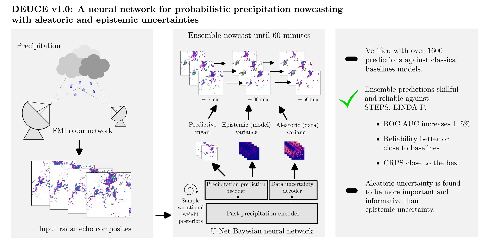

# DEUCE v1.0: A neural network for probabilistic precipitation nowcasting with aleatoric and epistemic uncertainties

This repository contains the source code used for the production of the results of the *DEUCE v1.0: A neural network for probabilistic precipitation nowcasting with aleatoric and epistemic uncertainties* 
manuscript by Bent Harnist, Seppo Pulkkinen, and Terhi Mäkinen, as well as instructions below for how to reproduce those results. 

> The data for reproducing experiments is available at https://doi.org/10.23728/fmi-b2share.3efcfc9080fe4871bd756c45373e7c11. 



## Training and making predictions

> ⚠️ The total storage space required for the data (including nowcasts) after running all scripts is ~ **300 GB**.

### Installation

Start by cloning the repository on a platform with GPU available. Make a new virtual environment for the training where you install the dependencies in `pytorch_requirements.txt`, including the [Tyxe](https://github.com/TyXe-BDL/TyXe) library that has to be installed from Github.

Fetch the training data (3.3 GB) and put it under the `data/` directory by moving there and using

```bash
wget https://fmi.b2share.csc.fi/api/files/6b8e9bff-c1f7-4fbf-b1d9-7f6544c1fe1f/deuce_inputs.zip
unzip deuce_inputs.zip && rm deuce_inputs.zip
```
The `data/deuce_inputs` directory now contains two HDF5 files:

|File|Description|
| --- | --- |
| `fmi_2019-2021_dataset_float.hdf5` | Cropped composites of the Training, validation, verification sets |
| `fmi_2022_case_dataset_float.hdf5` | Cropped composites for the 2022 case study |

#### Optional: Pretrained model checkpoints

Also fetch the model Pytorch Lightning checkpoints (2.7 GB) using

```bash
wget https://fmi.b2share.csc.fi/api/files/6b8e9bff-c1f7-4fbf-b1d9-7f6544c1fe1f/deuce_model_checkpoints.zip
unzip deuce_model_checkpoints.zip && rm deuce_model_checkpoints.zip
```

The `data/deuce_model_checkpoints` directory now contains three HDF5 files:

|File|Description|
| --- | --- |
| `deuce_checkpoint_1_epoch=19-step=107800.ckpt` | Initial checkpoint after training for 20 epochs with a 1e-4 lr|
| `deuce_checkpoint_2_epoch=7-step=43120.ckpt` | Second checkpoint after training for 8 more epochs with a 1e-5 lr|
| `deuce_model.ckpt` | Final (third) model checkpoint after training for 1 last epoch with a 1e-6 lr|

### Training DEUCE

The training configurations used are found under `config/deuce/`. The training can be run with the `train_model.py` script or submitted as a SLURM job with `train_model.sh`. `train_model.sh` contains the default configuration for producing the initial checkpoint `deuce_checkpoint_1_epoch=19-step=107800.ckpt`. Further training after this necessitates to have the configuration folder and model checkpoint arguments modified according to the stage. 

### Generating raw DEUCE ensemble predictions

Raw DEUCE ensemble prediction tuples $\mathbf{\hat{y}},\mathbf{\sigma}^2$ may be generated with `predict_model.py` script or by submitting a SLURM job with `predict_model.sh`. `predict_model.sh` contains the default configuration for generating the predictions for the verification dataset split. The case predictions (along with other 2022 cases) can be generated by changing the configuration folder argument to `config/deuce/deuce_cases_2022`.

## Baselines and verification

### Installation

Start by cloning the repository on your platform. Create a Conda environment from `verification_environment.yml`. Once this is done, switch to that environment and and install the `pincast_verif` package found under the `verification/` directory by moving there and running 

```
pip install -e .
```

Now fetch the radar composites used for the verification (1.5 GB) by moving to the `data/` directory and using 

```bash
wget https://fmi.b2share.csc.fi/api/files/6b8e9bff-c1f7-4fbf-b1d9-7f6544c1fe1f/verif_inputs.zip
wget https://fmi.b2share.csc.fi/api/files/6b8e9bff-c1f7-4fbf-b1d9-7f6544c1fe1f/verif_case_inputs.zip
unzip verif_inputs.zip && rm verif_inputs.zip
unzip verif_case_inputs.zip && rm verif_case_inputs.zip
mv verif_case_inputs/* verif_inputs/
rm -r verif_case_inputs/
```

This new folder contains raw uncropped FMI composites for the verification dataset split (2019-2021) and for the case study (2022). These will be accessed in the scripts by using the [fmi PGM](https://pysteps.readthedocs.io/en/stable/generated/pysteps.io.importers.import_fmi_pgm.html) importer from the [pySTEPS](https://pysteps.readthedocs.io/en/stable/) library. In order to use the library, one needs to set up the `pystepsrc` configuration file as instructed [here](https://pysteps.readthedocs.io/en/stable/user_guide/set_pystepsrc.html). Especially here, you will have to set the `fmi` data source configuration to 

```yaml
        "fmi": {
            "root_path": "$DEUCE_WORKING_DIRECTORY/data/verif_inputs",
            "path_fmt": "%Y/%m/%d/fmi/radar/composite/lowest",
            "fn_pattern": "%Y%m%d%H%M_fmi.radar.composite.lowest_FIN_SUOMI1",
            "fn_ext": "pgm.gz",
            "importer": "fmi_pgm",
            "timestep": 5,
            "importer_kwargs": {
                "gzipped": true
            }
        },
```

with `$DEUCE_WORKING_DIRECTORY` refers to the absolute path pointing to this repository. Also, make sure to have the raw DEUCE ensembles from [the above section](#generating-raw-deuce-ensemble-predictions) available.

#### Optional: Computed verification metrics

Pre-computed verification metrics (4.4 MB) can be fetched using

```bash
wget https://fmi.b2share.csc.fi/api/files/6b8e9bff-c1f7-4fbf-b1d9-7f6544c1fe1f/metrics.zip
unzip metrics.zip && rm metrics.zip
```

where the downloaded `data/metrics` contains final metric values in netcdf format, along with other outputs of the metric computation scripts, divided into four folders:

|Folder|Description|
| --- | --- |
| `deuce_deterministic_metrics` | Deterministic metrics (ETS,ME,RAPSD) |
| `deuce_probabilistic_metrics` | Probabilistic metrics (CRPS,RANKHIST,RELDIAG,ROC) |
| `deuce_rapsd_member_metric` | RAPSD for DEUCE ensemble members |
| `deuce_uncertainty_composition` | Aleatoric and epistemic components of DEUCE over the verification set |

### Measurements to HDF5

For DEUCE post-processing and metric calculation, we convert uncropped PGM composites to cropped images stored in an HDF5 archive similar to those containing nowcasts. This can be achieved by 

1. Creating the `data/baseline_nowcasts/` directory if not existing
2. Running the `save_measurements.py` script with given configurations for 2019-2021 data and 2022 case data respectively, i.e., 

```bash
python verification/scripts/save_measurements.py config/measurements/MEASUREMENTS/save_measurements.yaml
python verification/scripts/save_measurements.py config/measurements/MEASUREMENTS-2022-cases/save_measurements.yaml
```

### DEUCE post-processing

DEUCE raw nowcasts are post-processed using two distinctive scripts,

|Script|Description|Output|
| --- | --- | --- |
|`combine_prediction_uncertainties.py`|Extract epistemic and aleatoric variances, use them to estimate predictive variance, which is sampled using spatially-correlated noise and saved|$\mathbf{\hat{y}}^{\text{ens}}$|
|`extract_mean_prediction.py`|Extract and save the ensemble mean|$\mathbf{\hat{y}}_{\text{mean}}$|

Assuming that you have the inputs rightly named in the locations specified, these scripts are run using

```bash
python extract_mean_prediction.py -i data/deuce_nowcasts/deuce-raw.hdf5
python combine_prediction_uncertainties.py -i data/deuce_nowcasts/deuce-raw.hdf5 -o data/baseline_nowcasts/measurements.hdf5
```

### Baseline prediction generation

Baseline nowcasts for the work can be generated using the `verification/scripts/run_pysteps_prediction.py` script, i.e., 

```bash
python verification/scripts/run_pysteps_prediction.py config/baselines
```

The HDF5 archives of nowcasts will be saved under the `data/baseline_nowcasts` directory. Please consider that making these nowcasts (esp. LINDA-P nowcasts) takes considerable time.

### Metric computation

Once all nowcasts are produced, verification metrics can be computed using the `verification/scripts/calculate_metrics.py` script, run for all configurations using

```bash
# deterministic metrics (ETS,ME,RAPSD)
python verification/scripts/calculate_metrics.py config/metrics/calculate_det_metrics.yaml
# probabilistic metrics (CRPS,RANKHIST,RELDIAG,ROC)
python verification/scripts/calculate_metrics.py config/metrics/calculate_prob_metrics.yaml
# RAPSD for DEUCE ensemble members
python verification/scripts/calculate_metrics.py config/metrics/calculate_rapsd_member.yaml
```

Additionally, the composition statistics of the DEUCE predictive uncertainty can be computed using 

```bash
python compute_uncertainty_composition.py -p data/deuce_nowcasts/deuce-raw.hdf5 -o data/baseline_nowcasts/measurements.hdf5 -r data/metrics/deuce_uncertainty_composition
```

Resulting nowcasts and metrics are visualized using the Jupypter notebooks of the `notebooks/` directory. 
